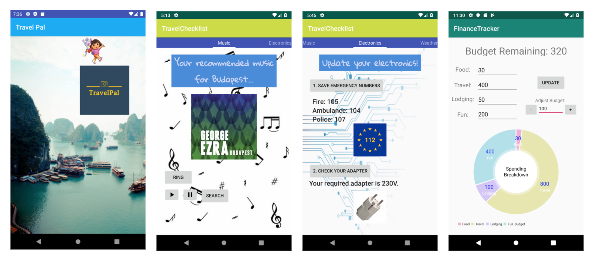

# kotlin-mobile
* **Description**: Android mobile applications using Kotlin/Android Studio. This repository only contains the **src/main** code. To run the program, you need Android Studio and other components of the app including the Gradle build, etc. After download, you should **Build > Clean Project** and **Build > Rebuild Project** to avoid errors with old APKs, etc
* **Date**: Feb - June 2019
* **Special Thanks**: Professor Ekler (AIT/BME) who provided guidance.

## Project 1: Paprika Sweeper  
Implements a Paprika-themed variation of the classic Minesweeper game. Uses XML UI, Custom views, basic View components, and Activity.
* [paprika-sweeper-main](https://github.com/jiinjeong/kotlin-mobile/tree/main/paprika-sweeper-main)   

## Project 2: Shopping List  
Implements basic shopping list application where users can see the items they wish to buy and mark the ones bought. Uses multiple Activities (including SplashActivity), list through RecyclerView, Dialogs, Animations, and Persistence data storage (Room).   

## Project 3: Weather  
Implements a Weather Info app using weather info from OpenWeatherMap. Uses network communication, HTTP, JSON parsing, and external libraries (Retrofit).   

## Project 4: Travel Pal  
* **Teammates**: Rachel Kang, Claire Donovan   

Implements a travel app that is personalized and encompassing, helping travelers before, during, and after the trip. Includes a packing list, music playlist, emergency information, map and diary feature, weather information, and budget planner. Uses network communication, Dialogs, Fragments, Adapter, and local data management through Room and DAO.   

