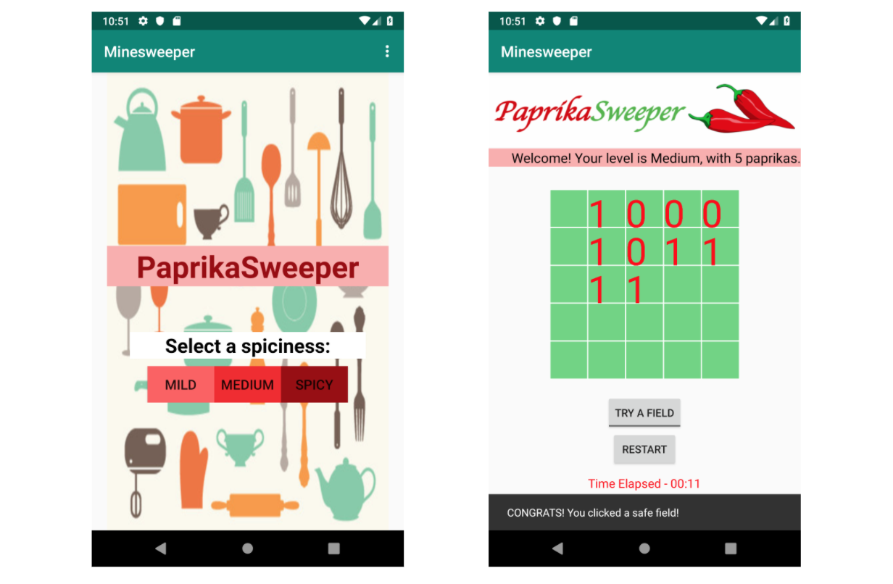
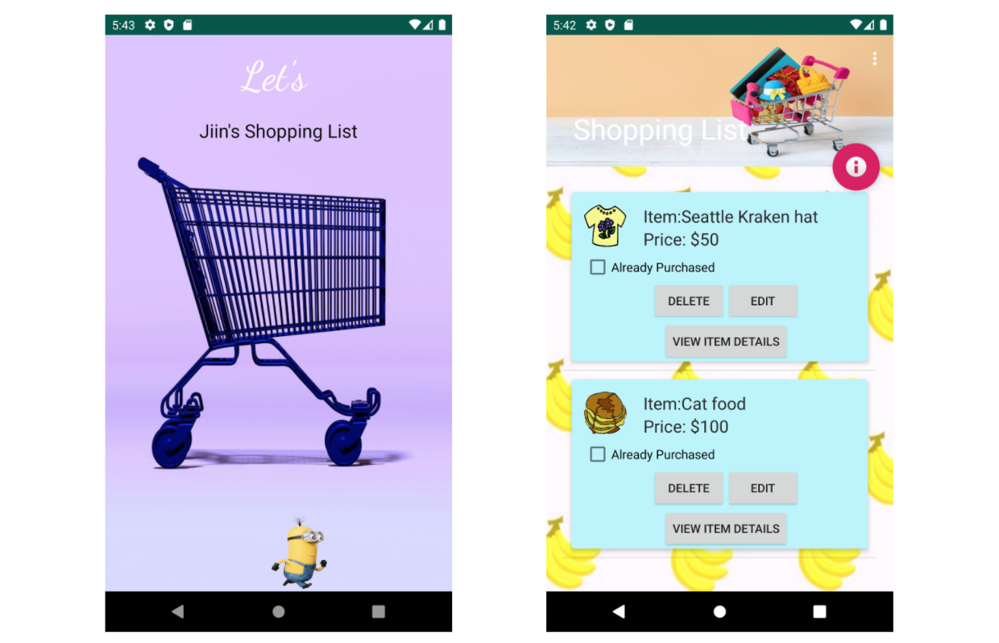
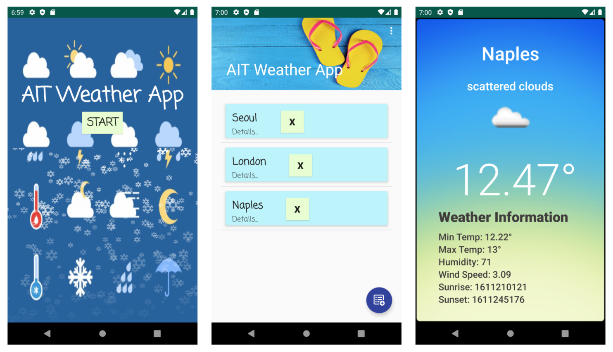

# kotlin-mobile
Android mobile applications using Kotlin/Android Studio (Feb - June 2019). This repository only contains that src/main code. To run the program, you need Android Studio and other components of the app including the Gradle build, etc. After download, you should Build > Clean Project and Build > Rebuild Project to avoid errors with old APKs, etc.

**Project 1: Paprika Sweeper**  
Implements a Paprika-themed variation of the classic Minesweeper game. Uses XML UI, Custom views, basic View components, and Activity.  

**Project 2: Shopping List**  
Implements basic shopping list application where users can see the items they wish to buy and mark the ones bought. Uses multiple Activities (including SplashActivity), list through RecyclerView, Dialogs, Animations, and Persistence data storage (Room).  

**Project 3: Weather**  
Implements a Weather Info app using weather info from OpenWeatherMap. Uses network communication, HTTP, JSON parsing, and external libraries.  

